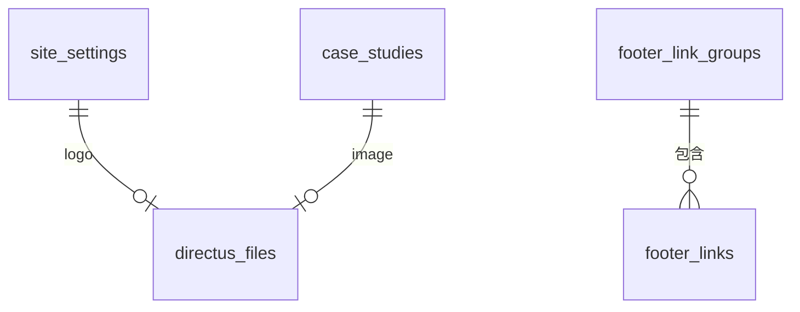
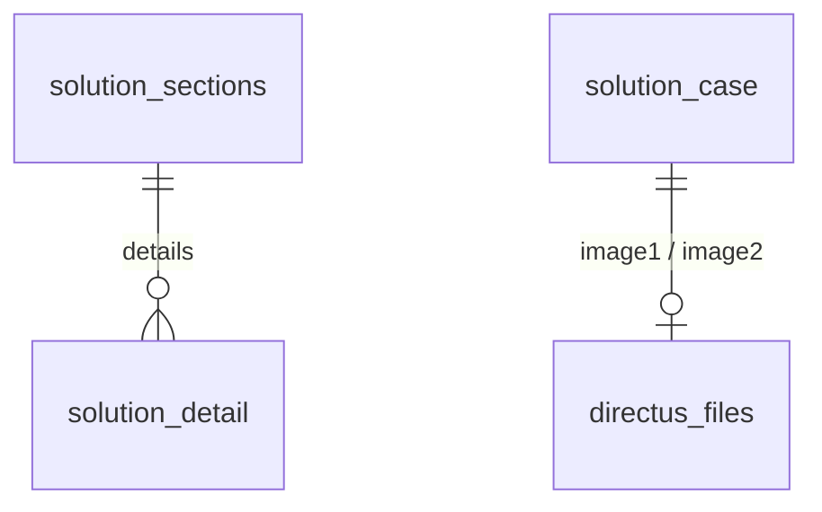

# LinkAll 凌茂电子 · 首页 Directus 数据模型设计文档

> 适用版本：**Directus 12.3.1**（PostgreSQL）
> 目标：用 Directus 作为内容后台，驱动「LinkAll 凌茂电子」官网首页，样式严格 100% 还原你提供的 `index.html`。
> 实例：`https://directus-production-18ce.up.railway.app`
> 状态：✅ **24 个集合已创建**（首页 13 + 子页面 11）、字段/关系已建好、HTML 真实文案已填充为种子数据、Public 只读 + CORS 已开启。
> 覆盖页面：**首页**（`homepage-render.html`）、**解决方案**（`solutions-render.html`）、**产品中心**（`products-render.html`），三页导航互通。子页面模型见 **第 9 节**。

---

## 集合命名规范（按页面前缀）

> 数据模型按「内容归属页面」统一集合前缀，便于辨识与维护：
> - 公共（顶栏 / 导航 / 页脚 / Logo / SEO） → `public_`
> - 首页专属区块 → `home_`
> - 解决方案子页 → `solution_`
> - 产品中心子页 → `product_`

**分类总览**

| 归属 | 前缀 | 集合 |
|---|---|---|
| 公共 | `public_` | `public_settings`、`public_nav`、`public_footer_groups`、`public_footer_links` |
| 首页 | `home_` | `home_hero`、`home_hero_meta`、`home_focus_cards`、`home_section_headings`、`home_solution_cards`、`home_application_items`、`home_case_studies`、`home_support_services`、`home_contact` |
| 解决方案 | `solution_` | `solution_page`、`solution_quicknav`、`solution_sections`、`solution_detail`、`solution_case`、`solution_case_fact`、`solution_industry`、`solution_delivery` |
| 产品中心 | `product_` | `product_page`、`product_filters`、`product_items` |

**改名对照表（旧 → 新）**

| 旧集合名 | 新集合名 | 归属 |
|---|---|---|
| `site_settings` | `public_settings` | 公共 |
| `nav_links` | `public_nav` | 公共 |
| `footer_link_groups` | `public_footer_groups` | 公共 |
| `footer_links` | `public_footer_links` | 公共 |
| `hero` | `home_hero` | 首页 |
| `hero_meta` | `home_hero_meta` | 首页 |
| `focus_cards` | `home_focus_cards` | 首页 |
| `section_headings` | `home_section_headings` | 首页 |
| `solution_cards` | `home_solution_cards` | 首页 |
| `application_items` | `home_application_items` | 首页 |
| `case_studies` | `home_case_studies` | 首页 |
| `support_services` | `home_support_services` | 首页 |
| `contact_block` | `home_contact` | 首页 |
| `solutions_page` | `solution_page` | 解决方案 |
| `products_page` | `product_page` | 产品中心 |

## 1. 设计原则

1. **单页站点 = 单例 + 可复用区块**
   - 不随内容变化的整段（顶部信息条、Hero、各区块标题、联系区、页脚）放进 **单例（singleton）集合**，后台只编辑一条记录。
   - 卡片 / 列表等可增删的内容放进 **可复用（repeatable）集合**，后台可自由排序、增删。
2. **内容归内容，样式归前端**
   - Directus 只存「文案 / 链接 / 图片引用」，CSS 完全沿用你给的 `index.html`（已放到渲染 Demo 中逐字保留）。
   - 前端按集合取数，套用同一套 class 名，即可 100% 还原视觉。
3. **关系最小化**
   - 仅两处真正需要关系：页脚链接归属分组（`footer_links → footer_link_groups`）、图片/Logo 引用（`directus_files`）。其余用普通字段即可。
4. **主键统一用 UUID**，便于前端无感引用、未来扩展多语言/多站点。

---

## 2. 集合总览

| # | 集合名 | 类型 | 用途 | 记录数(已填充) |
|---|--------|------|------|----------------|
| 1 | `public_settings` | 单例 | 全局配置：公司名、SEO、顶部信息条、联系方式、页脚文案、Logo | 1 |
| 2 | `public_nav` | 可复用 | 顶部主导航链接（可排序、可标记当前页） | 6 |
| 3 | `home_hero` | 单例 | Hero 主视觉区全部文案 | 1 |
| 4 | `home_hero_meta` | 可复用 | Hero 底部三项能力摘要（EMC / 电性能 / 自动化） | 3 |
| 5 | `home_focus_cards` | 可复用 | 「三条重点业务线」卡片 | 3 |
| 6 | `home_section_headings` | 单例 | 各区块标题（eyebrow / 标题 / 副文案） | 1 |
| 7 | `home_solution_cards` | 可复用 | 「解决方案」6 张卡片 | 6 |
| 8 | `home_application_items` | 可复用 | 「行业应用」列表项 | 3 |
| 9 | `home_case_studies` | 可复用 | 「精选案例」卡片（含 photo/data 两种样式） | 2 |
| 10 | `home_support_services` | 可复用 | 「服务与支持」4 张卡片 | 4 |
| 11 | `home_contact` | 单例 | 联系区文案 + CTA | 1 |
| 12 | `public_footer_groups` | 可复用 | 页脚链接分组（解决方案/服务支持/联系凌茂） | 3 |
| 13 | `public_footer_links` | 可复用 | 页脚具体链接（归属某分组） | 9 |

---

## 3. 字段定义

### 3.1 `public_settings`（单例）
| 字段 | 类型 | 说明 | 示例值 |
|------|------|------|--------|
| company_name | string | 公司全称 | 上海凌茂电子科技有限公司 |
| site_title | string | `<title>` | LinkAll 凌茂电子｜首页概念设计 |
| meta_description | text | SEO 描述 | 上海凌茂电子科技有限公司官网概念设计 |
| topline_lang_label | string | 语言切换标签 | 中文 / EN |
| topline_tagline | string | 顶部信息条加粗后缀 | · 首页概念设计 |
| footer_brand_text | text | 页脚品牌描述（换行=`<br>`） | 测试测量解决方案与工程服务\n上海凌茂电子科技有限公司 |
| footer_address | string | 页脚地址 | 上海市长宁区仙霞路369号1号楼603室 |
| footer_copyright | string | 版权行 | © 上海凌茂电子科技有限公司 · 概念设计稿 |
| contact_email | string | 联系邮箱 | linkall@inlinkall.com |
| contact_phone_display | string | 顶部信息条**展示**号码（`topline-tel` 链接文字） | 021-52831768 |
| contact_phone_tel | string | **唯一电话数据源**：驱动顶部信息条拨号链接 + 两个「致电技术咨询」按钮的 `tel:` | 02152831768 |
| logo | file → directus_files | 站点 Logo（需到文件管理器上传） | — |

### 3.2 `public_nav`（可复用，`sort_field=sort`）
| 字段 | 类型 | 说明 |
|------|------|------|
| label | string | 链接文字（首页/解决方案/…） |
| href | string | 链接地址（`#top`、`products.html`、`#solutions`…） |
| is_active | boolean | 是否当前页（首页=true → 红色下划线） |
| sort | integer | 排序 |

### 3.3 `home_hero`（单例）
| 字段 | 类型 | 说明 |
|------|------|------|
| eyebrow | string | 小标签 `Test with certainty` |
| title_main | string | 主标题前半 `让复杂测试` |
| title_highlight | string | 高亮段（渲染为 `<em>`）`更确定。` |
| subtitle | text | 副文案 |
| cta_primary_label / cta_primary_href | string | 主按钮文字/链接 |
| cta_secondary_label / cta_secondary_href | string | 次按钮文字/链接 |
| stage_label | string | 信号台标签 `SYSTEM STATUS / ACTIVE` |
| stage_mark | string | 右侧竖排 `TEST WITH CERTAINTY` |
| machine_name | string | 机器名牌 `LINKALL · TEST SYSTEM` |
| machine_status | text | 机器状态（换行=`<br>`） |

### 3.4 `home_hero_meta`（可复用，`sort_field=sort`）
| 字段 | 类型 | 说明 |
|------|------|------|
| title | string | 如 `EMC` |
| description | string | 如 `电磁兼容测试` |
| sort | integer | 排序 |

### 3.5 `home_focus_cards`（可复用，`sort_field=sort`）
| 字段 | 类型 | 说明 |
|------|------|------|
| index_label | string | `01 / EMC TESTING` |
| title | string | 卡片标题 |
| description | text | 卡片描述 |
| href | string | 跳转链接 |
| sort | integer | 排序 |

### 3.6 `home_section_headings`（单例）
每个区块一组三字段（eyebrow / title / subtitle），共 5 组：
`focus_*`、`solutions_*`、`applications_*`、`cases_*`、`support_*`。

### 3.7 `home_solution_cards`（可复用，`sort_field=sort`）
| 字段 | 类型 | 说明 |
|------|------|------|
| index_number | string | `01`~`06` |
| title | string | 方案标题 |
| description | text | 方案描述 |
| href | string | 跳转链接 |
| sort | integer | 排序 |

### 3.8 `home_application_items`（可复用，`sort_field=sort`）
| 字段 | 类型 | 说明 |
|------|------|------|
| index_number | string | `01`~`03` |
| name | string | 行业名（半导体/储能/材料科学） |
| description | string | 行业说明 |
| href | string | 跳转链接 |
| sort | integer | 排序 |

### 3.9 `home_case_studies`（可复用，`sort_field=sort`）
| 字段 | 类型 | 说明 |
|------|------|------|
| kicker | string | 案例标签 `FIELD EMC / POWER` |
| title | string | 案例标题 |
| description | text | 案例描述 |
| result_text | string | 结果文案（data 变体不填） |
| result_metric | string | 大号指标 `50%+`（photo 变体不填） |
| result_metric_label | string | 指标说明 |
| variant | select(photo/data) | 卡片样式变体 |
| image | file → directus_files | photo 变体背景图（可空） |
| href | string | 跳转链接 |
| sort | integer | 排序 |

### 3.10 `home_support_services`（可复用，`sort_field=sort`）
| 字段 | 类型 | 说明 |
|------|------|------|
| index_label | string | `01 / CONSULT` |
| title | string | 服务标题 |
| description | text | 服务描述 |
| sort | integer | 排序 |

### 3.11 `home_contact`（单例）
| 字段 | 类型 | 说明 |
|------|------|------|
| eyebrow | string | `Start a conversation` |
| title_line1 / title_line2 | string | 标题两行（中间 `<br>`） |
| cta_label | string | CTA 文字（按钮 `href` 由 `site_settings.contact_phone_tel` 统一生成 `tel:` 链接，原 `cta_href` 字段已删除） |

### 3.12 `public_footer_groups` + `public_footer_links`
- `public_footer_groups`：`title`(string)、`sort`(integer)、`links`(o2m → footer_links)
- `public_footer_links`：`label`(string)、`href`(string)、`group`(m2o → footer_link_groups)、`sort`(integer)

---

## 4. 关系（ER）



- `footer_links.group` → `footer_link_groups.id`（多对一）
- `site_settings.logo` / `case_studies.image` → `directus_files.id`（文件引用）

---

## 5. 区块 ↔ 集合 映射（内容还原对照）

| HTML 区块 | 数据来源 |
|-----------|----------|
| 顶部信息条 `.topline` | `public_settings`（company_name / topline_tagline / contact_phone_display / contact_phone_tel / topline_lang_label） |
| 导航 `.nav` | `public_nav` |
| Hero `.hero` | `home_hero` + `home_hero_meta` |
| 重点业务线 `.focus` | `section_headings.focus_*` + `home_focus_cards` |
| 解决方案 `.solutions` | `section_headings.solutions_*` + `home_solution_cards` |
| 行业应用 `.applications` | `section_headings.applications_*` + `home_application_items` |
| 案例 `.cases` | `section_headings.cases_*` + `home_case_studies` |
| 服务支持 `.support` | `section_headings.support_*` + `home_support_services` |
| 联系 `.contact` | `home_contact` |
| 页脚 `footer` | `public_settings`（品牌/地址/版权/邮箱/电话）+ `public_footer_groups`+`public_footer_links` |

---

## 6. 前端取数示例（REST）

渲染 Demo `homepage-render.html` 已内置完整实现。核心取数逻辑：

```js
const API = "https://directus-production-18ce.up.railway.app";
const q = (c, f="*", sort) =>
  `${API}/items/${c}?fields=${encodeURIComponent(f)}` + (sort ? `&sort=${sort}` : "");

const [site, hero, heroMeta, focus, heads, solutions, apps, cases, support, contact, nav, groups] =
  await Promise.all([
    fetch(q("public_settings")).then(r => r.json()).then(d => d.data),
    fetch(q("home_hero")).then(r => r.json()).then(d => d.data),
    fetch(q("home_hero_meta","*","sort")).then(r => r.json()).then(d => d.data),
    fetch(q("home_focus_cards","*","sort")).then(r => r.json()).then(d => d.data),
    fetch(q("home_section_headings")).then(r => r.json()).then(d => d.data),
    fetch(q("home_solution_cards","*","sort")).then(r => r.json()).then(d => d.data),
    fetch(q("home_application_items","*","sort")).then(r => r.json()).then(d => d.data),
    fetch(q("home_case_studies","*","sort")).then(r => r.json()).then(d => d.data),
    fetch(q("home_support_services","*","sort")).then(r => r.json()).then(d => d.data),
    fetch(q("home_contact")).then(r => r.json()).then(d => d.data),
    fetch(q("public_nav","*","sort")).then(r => r.json()).then(d => d.data),
    fetch(q("public_footer_groups","id,title,sort,links.*","sort")).then(r => r.json()).then(d => d.data),
  ]);
```

> GraphQL 亦可用：`{ site_settings { company_name logo { id } } hero { ... } }`，字段同名。

---

## 7. 上线前检查清单

- [x] 13 个集合、字段、关系已创建
- [x] HTML 真实文案已写入（种子数据）
- [x] Public 角色只读权限已开启（仅 `read`，不可写）
- [x] CORS 已开启（`cors_origin: *`，可收紧为你的域名）
- [ ] **上传 Logo**：到 Directus 文件管理器上传 `D_signal_motion.png`，在 `site_settings.logo` 选择
- [ ] **上传案例图**：上传 `gis-field-test.jpg`，在对应 `home_case_studies`（photo 变体）的 `image` 选择
- [ ] 如需收紧安全：`cors_origin` 改为你的前端域名；Public 权限可继续保留只读
- [ ] 接入你真正的前端框架（Nuxt / Next / Astro / 静态站），套用 `index.html` 原 CSS

---

## 8. 说明与后续

- 当前数据模型已可支撑首页 100% 还原；渲染 Demo 直接读取你的实例即可看到效果。
- 若后续要做「产品中心 / 行业页 / 案例详情」等子页面，可复用同样的模式新建集合（如 `products`、`industries`、`cases` 详情），本模型已为其预留 `href` 跳转位。
- 多语言：可在字段上挂 Directus 翻译（Translations），或新建 `*_en` 集合，本结构不冲突。

---

## 9. 子页面扩展：解决方案 + 产品中心

> 在首页模型基础上，为 `解决方案.html`、`产品中心.html` 两个页面各建一套集合，样式仍 100% 沿用原 CSS。
> 三页共用 `public_settings` / `public_nav` 作为全局外壳（顶栏、导航、页脚），导航 `href` 已改为三个 render 文件名，实现点击跳转。

### 9.1 新增集合总览（11 个）

| # | 集合名 | 类型 | 用途 | 记录数 |
|---|--------|------|------|--------|
| 14 | `solution_page` | 单例 | 解决方案页：Hero、快捷导航标题、交付提示、联系区文案 | 1 |
| 15 | `solution_quicknav` | 可复用 | 页内快捷导航（4 条锚点） | 4 |
| 16 | `solution_sections` | 可复用 | 两大解决方案板块（PCB 板级 / 现场骚扰）+ 板块内 intro/dataflow | 2 |
| 17 | `solution_detail` | 可复用 | 板块明细（流程/模块/能力/数据流），m2o 归属板块 | 16 |
| 18 | `solution_case` | 单例 | 解决方案页案例区（含 2 张图与图注） | 1 |
| 19 | `solution_case_fact` | 可复用 | 案例事实点（CHALLENGE/METHOD/OUTPUT） | 3 |
| 20 | `solution_industry` | 可复用 | 解决方案页行业背景 3 项 | 3 |
| 21 | `solution_delivery` | 可复用 | 系统交付方式 4 项 | 4 |
| 22 | `product_page` | 单例 | 产品中心页：Hero、目录标题、资料申请区、meta 链接 | 1 |
| 23 | `product_filters` | 可复用 | 产品筛选分类（7 个：全部/电磁兼容/功率电子/…） | 7 |
| 24 | `product_items` | 可复用 | 产品卡片（tag/标题/描述/类目/搜索关键字/链接） | 12 |

### 9.2 关键字段

**`solution_page`（单例）**：`topline_tagline`、`quicknav_label`、`hero_crumb`、`hero_eyebrow`、`hero_title_1`、`hero_title_2`、`hero_subtitle`、`hero_tags`(逗号分隔)、`delivery_notice`、`contact_eyebrow`、`contact_title_1`、`contact_title_2`、`contact_cta_label`。

**`solution_sections`（可复用）**：`eyebrow`、`title`、`subtitle`、`layout`(select: `pcb`/`field`)、`intro_eyebrow`/`intro_title`/`intro_desc`/`scope_tags`(pcb 用)、`dataflow_eyebrow`/`dataflow_title`(field 用)、`details`(o2m → solution_detail)、`sort`。

**`solution_detail`（可复用）**：`section_id`(m2o → solution_sections)、`group`(select: `process`/`module`/`capability`/`flow`)、`index_label`、`title`、`desc`、`sort`。

**`solution_case`（单例）**：`eyebrow`、`title`、`subtitle`、`copy_eyebrow`、`copy_title`、`copy_desc`、`image1`/`image1_caption`、`image2`/`image2_caption`（image 为 file → directus_files）。

**其余列表中字**：`solution_quicknav`(label/href/sort)、`solution_case_fact`(label/desc/sort)、`solution_industry` 与 `solution_delivery`(index_label/title/desc/sort)。

**`product_page`（单例）**：`hero_crumb`、`hero_eyebrow`、`hero_title_1`、`hero_title_2`、`hero_subtitle`、`catalog_title`、`catalog_subtitle`、`meta_link_text`、`meta_link_href`、`request_title`、`request_desc`、`request_cta_label`、`request_cta_href`。

**`product_filters`（可复用）**：`label`、`value`(对应前端 `data-filter`)、`sort`。
**`product_items`（可复用）**：`tag`、`title`、`desc`、`category`(对应 `data-filter` 值)、`foot_label`、`link_label`、`link_href`、`search_kw`(搜索关键字，可含型号/别名)、`sort`。

### 9.3 关系


- `solution_detail.section_id` → `solution_sections.id`（多对一）；`solution_sections.details` 为反向外键（o2m，取数用 `fields=*,details.*`）。

### 9.4 区块 ↔ 集合 映射

| 页面区块 | 数据来源 |
|----------|----------|
| 解决方案 · Hero | `solution_page`（hero_*）+ 静态信号图 |
| 解决方案 · 快捷导航 | `solutions_page.quicknav_label` + `solution_quicknav` |
| 解决方案 · SOLUTION 01/02 | `solution_sections`（含 intro/dataflow）+ `solution_detail`（按 group 分段） |
| 解决方案 · 现场案例 | `solution_case` + `solution_case_fact` |
| 解决方案 · 行业背景 / 交付方式 | `solution_industry` / `solution_delivery` + `solutions_page.delivery_notice` |
| 产品中心 · Hero / 目录标题 | `product_page` |
| 产品中心 · 筛选按钮 | `product_filters` |
| 产品中心 · 产品卡片 + 搜索 | `product_items`（`category` 供筛选、`search_kw` 供搜索） |
| 产品中心 · 资料申请区 | `products_page.request_*` |

### 9.5 三页导航（`public_nav` 已更新）

| 导航文字 | href | 高亮规则 |
|----------|------|----------|
| 首页 | `homepage-render.html` | 在首页时高亮 |
| 解决方案 | `solutions-render.html` | 在解决方案页高亮 |
| 行业应用 | `homepage-render.html#applications` | 锚点，不高亮 |
| 产品中心 | `products-render.html` | 在产品中心页高亮 |
| 服务与支持 | `homepage-render.html#support` | 锚点，不高亮 |
| 关于凌茂 | `homepage-render.html#about` | 锚点，不高亮 |

> 高亮逻辑：前端按「当前文件名 == 链接文件名且链接不含 `#`」判定，故三个页面共用同一份 `public_nav` 也能各自正确高亮。

### 9.6 子页面取数示例（REST）

```js
// 产品中心：筛选 + 搜索均基于 product_items
const [pp, filters, items] = await Promise.all([
  fetch(q("product_page")).then(r=>r.json()).then(d=>d.data),
  fetch(q("product_filters","*","sort")).then(r=>r.json()).then(d=>d.data),
  fetch(q("product_items","*","sort")).then(r=>r.json()).then(d=>d.data),
]);
// 解决方案：板块带出明细
const [sp, quick, sections, cas, facts, industry, delivery] = await Promise.all([
  fetch(q("solution_page")).then(r=>r.json()).then(d=>d.data),
  fetch(q("solution_quicknav","*","sort")).then(r=>r.json()).then(d=>d.data),
  fetch(q("solution_sections","*,details.*","sort")).then(r=>r.json()).then(d=>d.data),
  fetch(q("solution_case")).then(r=>r.json()).then(d=>d.data),
  fetch(q("solution_case_fact","*","sort")).then(r=>r.json()).then(d=>d.data),
  fetch(q("solution_industry","*","sort")).then(r=>r.json()).then(d=>d.data),
  fetch(q("solution_delivery","*","sort")).then(r=>r.json()).then(d=>d.data),
]);
```

### 9.7 子页面待办

- [ ] **案例图**：到文件管理器上传 2 张 GIS 案例图，填入 `solution_case.image1` / `image2`（不填则显示灰色占位块 + 图注）。
- [ ] 产品卡片如需图片，可在 `product_items` 增加 `image` 文件字段并在卡片模板中引用。
